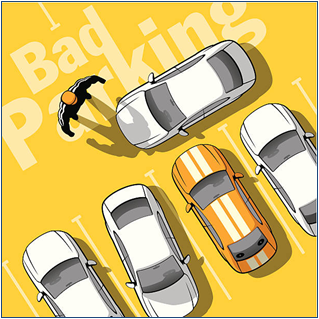

Project Title: PARK-PRO
Project Overview:
The QR-Based Box Parking Management System is a web interface designed to solve the common issue of blocked parking, specifically in scenarios known as "box parking." Box parking occurs when a vehicle is parked in a way that blocks other vehicles from exiting their parking space, creating significant inconvenience for other drivers.

  

  
Fig-Box-Parking

